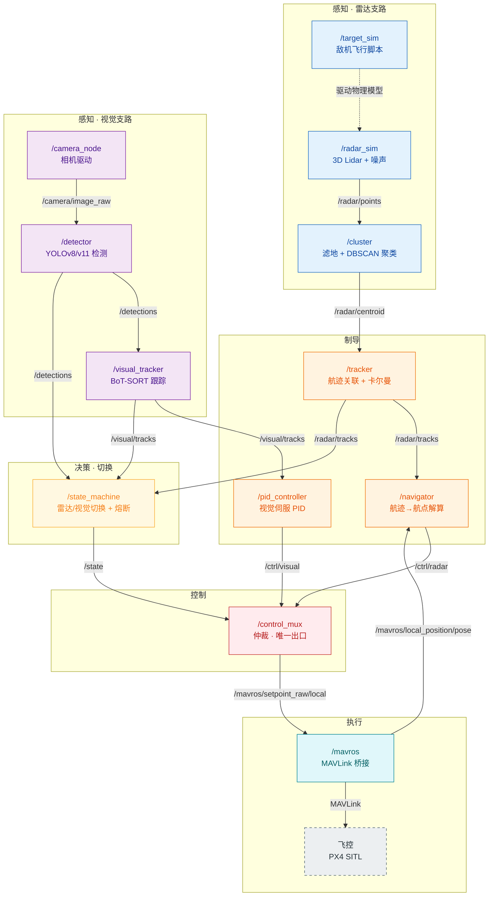
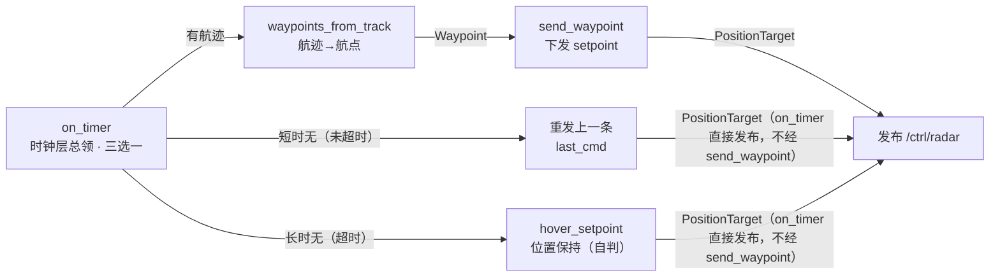
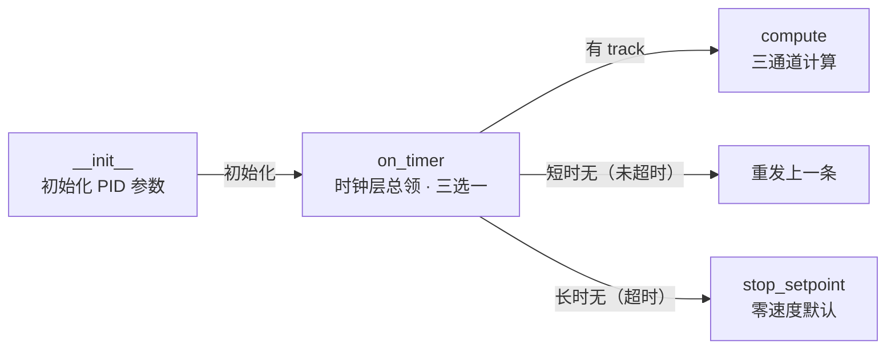
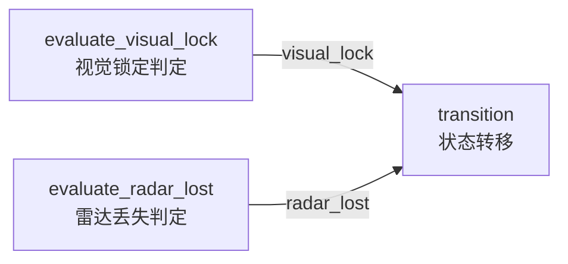
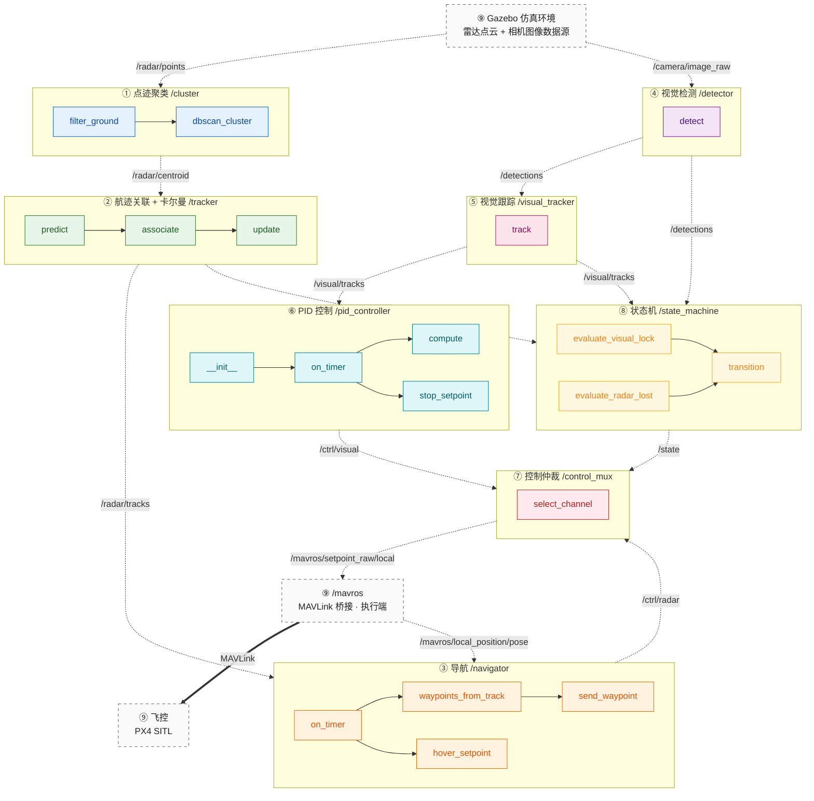

# 函数接口调用关系图（Flowchart 版）

> 依据《无人机项目实施拆解文档》绘制，使用 Mermaid `flowchart`。
>
> 图例约定（**分图说明——图一与图三的线型语义不同，勿混看**）：
> - **图一（模块间全局图）**：实线箭头 `-->` = ROS 话题数据流；虚线箭头 `-.->` = 非 ROS 话题的物理仿真关联（仅 `/target_sim → /radar_sim`）
> - **图二（模块内部图）**：实线箭头 = 函数调用
> - **图三（总图）**：模块**内**实线 = 函数调用；模块**间**虚线 = ROS 话题数据流（⚠️ 与图一虚线的含义不同）
> - **箭头标签**：话题名 或 传递的数据
> - **着色**：图一按支路着色、图三按模块着色，颜色对照见文末表（图一配色见其 `classDef` 注释）
> - **省略说明**：图一为清晰起见，省略了 debug 话题（`/target/pose`、`/gazebo/model_states`），仅保留核心控制闭环数据流（`/mavros/local_position/pose` 为 navigator 悬停的功能输入、属核心闭环，已画出）。

---

## 一、模块间接口关系图（全局）

> 展示 12 个 ROS 节点（另加 1 个「飞控 PX4 SITL」执行体，非 ROS 节点）的订阅/发布串接关系，即整个系统的数据流闭环。

> 图一连线标签只标话题名，各话题的消息类型见《数据类型.md》第五章。

---

## 二、各模块内部函数调用关系图

### 模块 1：点迹聚类（`/cluster`）

### 模块 2：航迹关联 + 卡尔曼滤波（`/tracker`）

### 模块 3：导航（`/navigator`）

### 模块 4：视觉检测（`/detector`）

### 模块 5：视觉跟踪（`/visual_tracker`）

### 模块 6：PID 控制（`/pid_controller`）

### 模块 7：控制仲裁（`/control_mux`）

### 模块 8：状态机（`/state_machine`）

---

## 三、全部函数接口总图（按模块着色）

> 一张图包含全部 19 个函数，模块内实线为函数调用，模块间虚线为 ROS 话题数据流；每个模块使用独立配色。
> 另含 3 个外部节点（`Gazebo` 数据源、`mavros` 执行端、飞控 `PX4 SITL`），用灰色虚线边框区分；其中 `mavros ==> 飞控` 为 MAVLink 协议连接（非 ROS 话题，粗箭头）。

### 模块着色对照表

| 颜色类 | 模块 | 填充色 | 描边色 |
|---|---|---|---|
| `c1` | ① 点迹聚类 | `#e3f2fd` | `#1565c0` |
| `c2` | ② 航迹关联 + 卡尔曼 | `#e8f5e9` | `#2e7d32` |
| `c3` | ③ 导航 | `#fff3e0` | `#ef6c00` |
| `c4` | ④ 视觉检测 | `#f3e5f5` | `#7b1fa2` |
| `c5` | ⑤ 视觉跟踪 | `#fce4ec` | `#c2185b` |
| `c6` | ⑥ PID 控制 | `#e0f7fa` | `#00838f` |
| `c7` | ⑦ 控制仲裁 | `#ffebee` | `#c62828` |
| `c8` | ⑧ 状态机 | `#fff8e1` | `#f9a825` |
| `ext` | ⑨ 外部（Gazebo / mavros / 飞控） | `#fafafa` | `#616161` |
