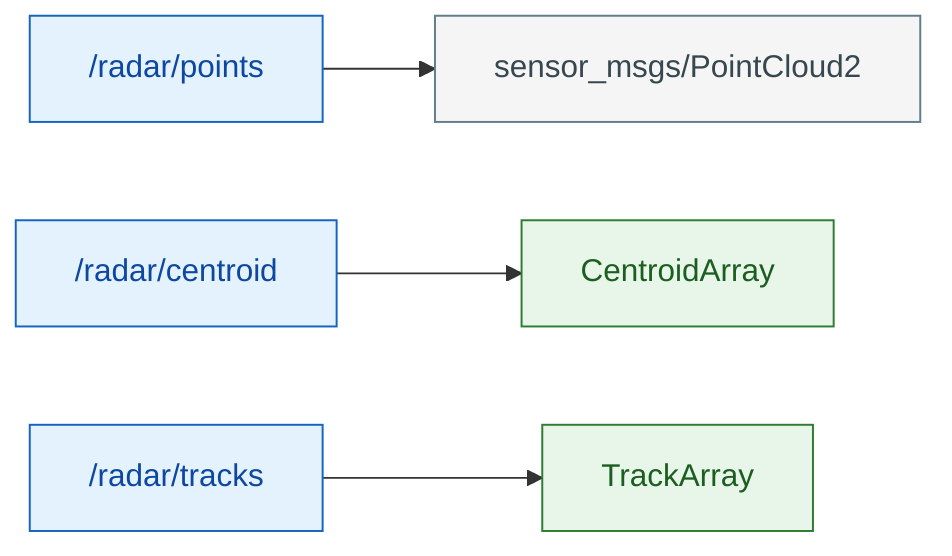
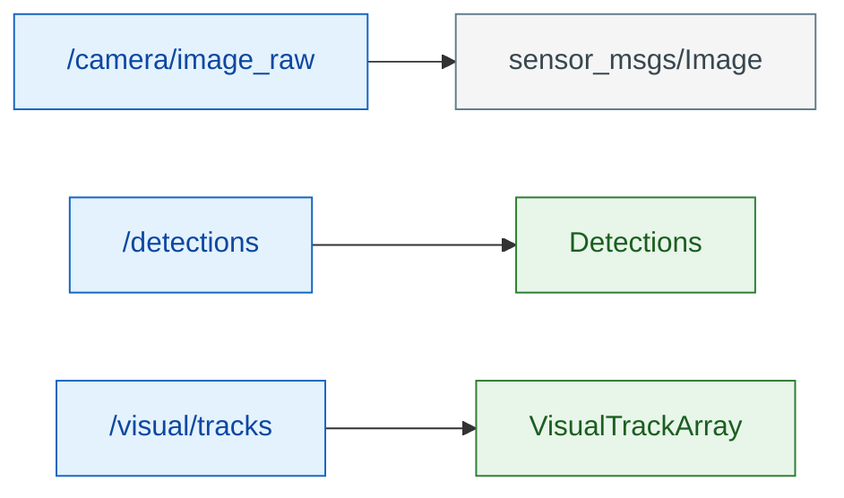
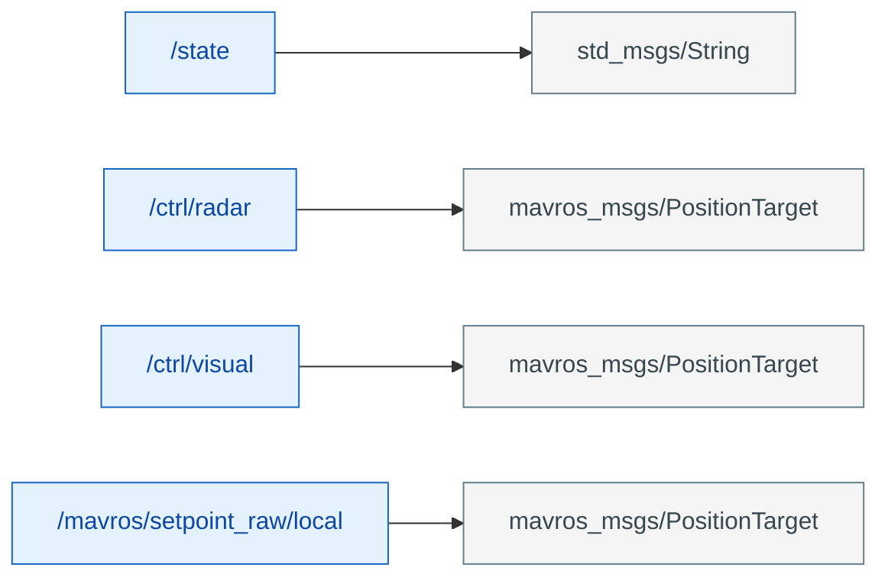
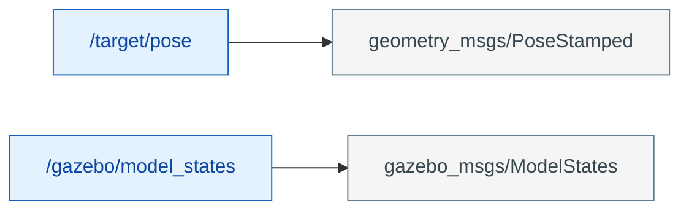

# 数据类型定义

> 依据《无人机项目实施拆解文档》第二章（自定义消息）、第三章（模块数据结构）与第四章（状态机）整理。
> 凡文档已明确定义的字段一律照搬，不改动、不新增、不虚构。

---

## 一、自定义 ROS 消息（`msg/` 目录）

> 来源：第二章「自定义消息」小节原文定义。

### 1.1 `DetectedTarget.msg`

| 字段 | 类型 | 说明 |
|---|---|---|
| `class_id` | `int32` | 类别 ID |
| `confidence` | `float32` | 置信度 |
| `bbox` | `float32[4]` | 边界框 `[x, y, w, h]` |

### 1.2 `Detections.msg`

| 字段 | 类型 | 说明 |
|---|---|---|
| `targets` | `DetectedTarget[]` | 检测目标数组 |

### 1.3 `VisualTrack.msg`

| 字段 | 类型 | 说明 |
|---|---|---|
| `id` | `int32` | 航迹 ID |
| `bbox` | `float32[4]` | 边界框 `[x, y, w, h]` |
| `area_ratio` | `float32` | bbox 面积 / 画面总面积 |

### 1.4 `VisualTrackArray.msg`（视觉航迹数组，`/visual/tracks` 使用）

| 字段 | 类型 | 说明 |
|---|---|---|
| `tracks` | `VisualTrack[]` | 视觉航迹数组 |

### 1.5 `Track.msg`（雷达航迹）

| 字段 | 类型 | 说明 |
|---|---|---|
| `id` | `int32` | 航迹 ID |
| `position` | `float64[3]` | `x, y, z` |
| `velocity` | `float64[3]` | `vx, vy, vz` |
| `covariance` | `float64[36]` | 6×6 协方差 |
| `age` | `uint32` | 航迹年龄 |

### 1.6 `TrackArray.msg`（雷达航迹数组，`/radar/tracks` 使用）

| 字段 | 类型 | 说明 |
|---|---|---|
| `tracks` | `Track[]` | 航迹数组 |

### 1.7 `CentroidArray.msg`（聚类质心数组，`/radar/centroid` 使用）

| 字段 | 类型 | 说明 |
|---|---|---|
| `centroids` | `geometry_msgs/PointStamped[]` | 聚类质心数组 |

---

## 二、Python 内部数据结构

> 来源：第三章模块拆分中给出的 `dataclass` / 类，字段照搬。

### 2.1 `Point3D`（点迹聚类）

| 字段 | 类型 | 说明 |
|---|---|---|
| `x` | `float` | 空间坐标 x |
| `y` | `float` | 空间坐标 y |
| `z` | `float` | 空间坐标 z |
| `intensity` | `float` | 强度（默认 0.0） |

### 2.2 `Cluster`（聚类结果）

| 字段 | 类型 | 说明 |
|---|---|---|
| `id` | `int` | 聚类 ID |
| `centroid` | `tuple[float, float, float]` | 质心 `(x, y, z)` |
| `points` | `list[Point3D]` | 簇内点集 |
| `size` | `int` | 簇内点数 |

### 2.3 `TrackState`（卡尔曼航迹内部状态）

> 注意：与 1.5 的 `Track.msg`（ROS 消息）区分——此处为滤波内部数据结构，消息用 `Track.msg`。

| 字段 | 类型 | 说明 |
|---|---|---|
| `id` | `int` | 航迹 ID |
| `state` | `np.ndarray` | 状态量 `(6,)`：`[x, y, z, vx, vy, vz]` |
| `cov` | `np.ndarray` | 协方差 `(6, 6)` |
| `age` | `int` | 航迹年龄 |
| `last_update` | `float` | 上次更新时间 |

### 2.4 `Detection`（视觉检测结果）

| 字段 | 类型 | 说明 |
|---|---|---|
| `bbox` | `tuple[float, float, float, float]` | 边界框 `(x, y, w, h)` |
| `class_id` | `int` | 类别 ID |
| `confidence` | `float` | 置信度 |

### 2.5 `KalmanTracker`（卡尔曼跟踪器类）

| 成员 | 说明 |
|---|---|
| `predict(dt)` | 状态预测 |
| `update(measurement)` | 量测更新 |
| `associate(measurements)` | 航迹关联 |

### 2.6 `PIDController`（PID 控制器类）

| 成员 | 说明 |
|---|---|
| `kp` / `ki` / `kd` / `max_out` | PID 增益与输出限幅 |
| `compute(setpoint, measurement, dt)` | 计算控制量 |

---

## 三、状态枚举（状态机 `/state_machine` 与仲裁 `/control_mux` 共用）

> 第二章 `/state` 为 `std_msgs/String`；第四章给出如下状态值，取值照搬原文。

| 状态值 | 含义 |
|---|---|
| `RADAR_GUIDE` | 雷达宏观引导 |
| `VISUAL_LOCK` | 视觉末端伺服 |
| `SEARCH/RTH` | 兜底（雷达也无航迹） |

> 注：`/control_mux` 仲裁规则中仅显式区分 `RADAR_GUIDE` 与 `VISUAL_LOCK`，其余值（含 `SEARCH/RTH`）均回退到 `/ctrl/radar`，未收到 `/state` 时初始默认亦为雷达路；超时检测不做（方案 B，见主文档第八章第 8 条）。

---

## 四、文档引用但未定义的类型

> 以下类型在文档中被使用，但未给出字段定义，此处不虚构字段，仅记录出处。

### 4.1 `Waypoint`（导航航点）

- 出处：第三章 3.3 `waypoints_from_track(track) -> list[Waypoint]`
- 说明：航点序列，首点为当前目标航点，余为预测/历史航点（用于 RViz 航路绘制与航迹回放）。文档未定义字段，实现时再定。

---

## 五、外部标准 ROS 消息（非自定义，仅列出引用）

> 来源：第二章节点通信图谱引用的 ROS 标准 / MAVROS 消息，非本项目自定义，仅列出以明确接口边界。

| 类型 | 所属话题 | 说明 |
|---|---|---|
| `sensor_msgs/PointCloud2` | `/radar/points` | 雷达点云 |
| `sensor_msgs/Image` | `/camera/image_raw` | 相机图像 |
| `std_msgs/String` | `/state` | 状态机状态 |
| `mavros_msgs/PositionTarget` | `/ctrl/radar` `/ctrl/visual` `/mavros/setpoint_raw/local` | setpoint 指令 |
| `geometry_msgs/PoseStamped` | `/mavros/local_position/pose` | 飞控位姿回传 |
| `geometry_msgs/PoseStamped` | `/target/pose` | 敌机位姿（仅 debug） |
| `gazebo_msgs/ModelStates` | `/gazebo/model_states` | Gazebo 模型状态（debug） |

---

## 六、话题 → 消息类型速查图

> 直观展示每个话题承载的消息类型（仅到类型名，字段定义见上文各章节），按链拆分为 5 张独立小图，避免拥挤。
> 配色：话题节点为**蓝色**；消息类型节点分两类——**自定义消息**为绿色、**标准消息**为灰色（带 `包名/` 命名空间前缀）。
> 注：`mavros_msgs/PositionTarget` 与 `geometry_msgs/PoseStamped` 被多个话题复用，此处按「每个话题各画一个类型节点」呈现。

### 6.1 ① 雷达链

### 6.2 ② 视觉链

### 6.3 ③ 决策 / 控制

### 6.4 ④ 位姿回传

### 6.5 ⑤ debug（仅调试）

